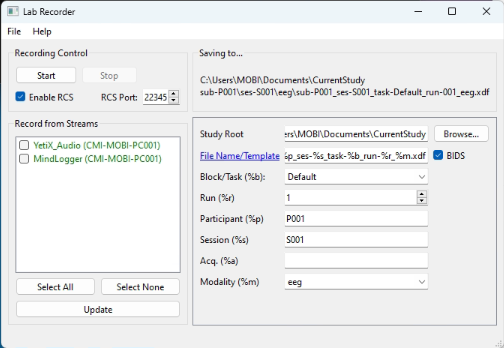

# Logitech G Yeti X Microphone

## Specifications

### Performance Specifications

| _Specification_ | Details  |
|--------------------------|-------------------------------|
| _Polar Patterns_| Cardioid, Omnidirectional, Bidirectional, Stereo  |
| _Mounting_ | Removable desktop stand (included), can be mounted to boom arm |
| _Consumption_         | 62 mA - 203 mA    |
| _Capsules_         | 4x 0.55 in (14 mm) condenser capsules    |
| _Frequency Response_ | 20 Hz - 20 kHz |
| _Dimensions_ | 4.33 in (11 cm) x 4.80 in (12.2 cm) x 11.38 in (28.9 cm) |
| _Weight_          | With stand:  2.8 lbs (1.28 kg) |
|               | Microphone only: 1.14 lbs (.519 kg) |
| _Compatibility_         | Windows 10 or later   |
|                          | macOS 10.14 or later  |
| _Cable_          | USB 1.1/2.0/3.0 |

### Headphone Amplifier Specifications

| _Specification_ | Details  |
|--------------------------|-------------------------------|
| _Impedance_                | 13 Ohms min, 16 Ohms typical  |
| _Power Output (RMS)_     | 72 mW per channel |
| _Frequency Response_       | 20 Hz - 20 kHz |
| _Signal to Noise_             | 100 dB |

Documentation from Logitech for setup, downloads, videos, warranty information, and more [here](https://support.logi.com/hc/en-us/articles/13171658546583-Getting-Started-Yeti-X).

### In the Box
The following should be included in the box:

- Yeti X microphone
- Desktop stand
- USB cable
- User documentation

## Hardware Setup

1. Open your Blue Yeti X Microphone.
2. Plug it in.

## Software Setup

1. Double Click on YetiX_Audio_Streamer.exe
    

2. A Command Prompt will appear, showing the stream has started. Press ++ctrl++ + C to stop.
    

3. Make sure YetiX_Audio shows up on your LabRecorder!
    

