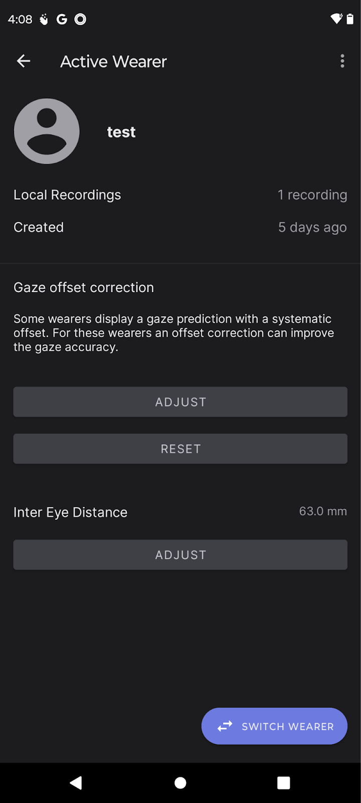
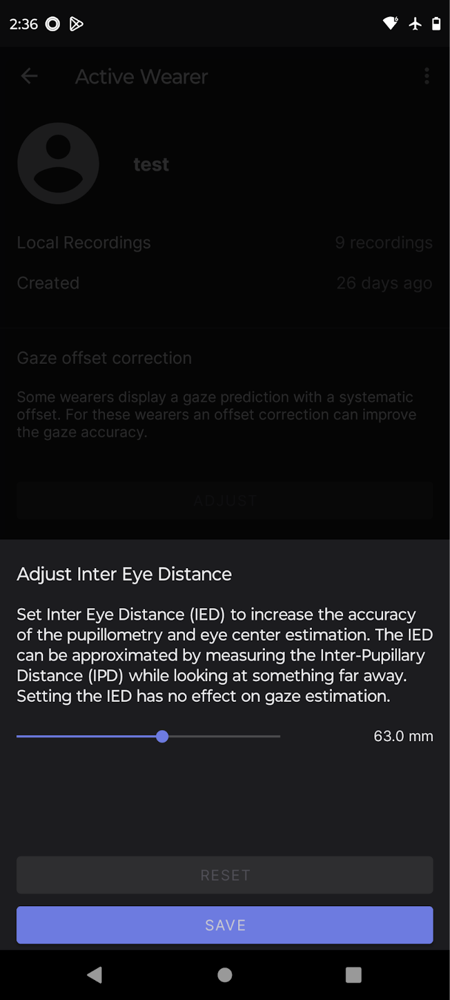

# Wearable Eye tracker: Neon by Pupil Labs

## Specifications

| _Specification_        | Details                                                                                                 |
|--------------------------|---------------------------------------------------------------------------------------------------------|
| _Sampling Rate_        | Up to 200Hz, default 200Hz                                                                              |
| _Gaze Accuracy_        | 1.8° uncalibrated, 1.3° with offset correction                                                          |
| _Gaze Spatial Resolution_ | 1600x1200 px                                                                                        |
| _PC Interface_         | Neon Companion App, LSL Relay                                                                          |
| _Eye Tracking Technology_ | Real-time neural network                                                                            |
| _Binocular Eye Tracking_ | Yes                                                                                                   |
| _Calibration_          | Calibration-free                                                                                       |
| _Slippage Compensation_ | Slippage invariant. Deep learning powered.                                                            |
| _Scene Camera_         | 1600 x 1200 @ 30Hz                                                                                     |
|                          | H: 1320, V: 810                                                                                        |
| _Eye Cameras_          | 2 x IR eye cameras                                                                                    |
|                          | 192 x 192 @ 200 Hz                                                                                     |
| _IMU_                  | Accelerator, Magnetometer, Gyroscope                                                                   |
| _Microphone_           | Dual microphone                                                                                         |
| _Battery Recording Time_ | Up to 4 hours                                                                                        |
|                          | 25+ hours of recording storage                                                                         |
| _Cable_                | USB-C                                                                                                  |
| _Computing Device_     | Mobile phone: Motorola Edge 40 Pro                                                                     |
| _Real-time Data_       | 2D gaze points in scene camera coordinates at 200 Hz Full head pose, accelerometer and gyro data at 110 Hz IR eye video showing fused eye regions at 200Hz RGB scene video at 30 Hz & Pupilometry data and eye state  (Available in Pupil Cloud) Eye position, eye orientation, pupil diameter                                                          |
| _Software_             | Real-time: Neon Companion App                                                                         |
|                          | Post-hoc: Pupil Cloud                                                                                 |

Documentation from Pupil Labs spanning the following topics: Hardware, Data Collection, Pupil Cloud (tool where data is uploaded), Neon Player (tool for playing back and exporting recordings), Real-Time API, Neon XR [Here](https://docs.pupil-labs.com/neon/).

### Adult frames: Just Act Natural

### Child frames: All Fun and Games (Ages 2 - 8)

## Hardware Setup

### Out of Box Setup for Neon by Pupil Labs

#### Equipment

The following equipment should be included in the Pupil Labs hardware: 

 - Phone to run the wearable eye tracker 
 - Adult frames (that has a space to store the Anker phone)
 - Child frames 
 - Lens kit 

You will also need an Anker dongle [Amazon link](https://www.amazon.com/Anker-PowerExpand-Ethernet-Delivery-MacBook/dp/B08C9HZ5YT/). This is not included with Pupil Lab Neon and has been ordered separately.

### Setup Steps

Please follow steps 1 - 9 for the Out of Box instructions to setup the hardware (the wearable glasses)

1. Open the Adult frames and pull out the phone. Turn on the phone.
    - Put a screen protector and a case [link to case] on the phone. Follow the instructions per the screen protection kit: [link to screen protector].
    - Login for phone: 0000 (press 4 times and then press enter - this is not like iPhone where it will go automatically).
    - Use the following Google Account to set-up the phone. This is the Google account used from Neon Companion App and Pupil Labs Cloud:
        - User:
        - PW: 

2. Open the Neon Pamphlet and follow the instructions, which are also written in steps 3 - 4.

3. Install Neon Companion App. Open Google Play Store and search “Neon Companion”.

4. Open Neon Companion App.

5. Plug glasses into the phone.

    - First time you plug in glasses to the phone, it will ask you to allow the Neon Companion to access the Neon Sensor Module and Neon Scene Camera v1. Check the Always open… box, and press OK.  
    
    

6. In the Neon Companion App, there are three “tabs” at the bottom.

    

    - ⭘ (red) - Allows you to view recordings.
    - ⭘ (blue) - Recording screen.
    - ⭘ (green) - Live Preview. This shows you the view from the glasses.

7. You need to set-up different “Wearers” on the account. Make sure you are in the recording tab (see #6; the blue circle in the image). In the recording tab, go to the bottom left side and click on “Wearer”.
    - Create a wearer called “tester” to run a test recording.
    - Click “Switch Wearer” to create different wearer profiles. Then click the “+ New Wearer” bottom on the bottom right.

    

8. There needs to be 16 different profiles to accommodate users and participants with varying inter eye distance. Label profiles with just a single number, 50-65. For each profile, click “Adjust” under “Inter Eye Distance” and slide accordingly for the right profile.

    

9. To switch between wearer profiles, click “Switch Wearer” and then click on the profile you want. Click “Activate” to switch to that profile.

    

**The hardware is all set-up and ready to start recording!**

## Software Setup

### LabRecorder Setup

Please refer to LabRecorder Setup from the Computing Setup Guide.

### Running LSL Relay & Streaming to LabRecorder

1. Make sure the connection from the router to the Anker dongle into the Neon Companion Device (Motorola Phone) and the Neon Glasses is secure (see picture below for reference).

    

    ⭘ (red) - Ethernet Cable /  from Anker Hub to Network Router  
    ⭘ (yellow) - USB-C / Power Outlet (included with Neon Glasses) to Anker Hub ('PD IN' port)  
    ⭘ (blue) - USB-C / Anker Hub to Neon Companion Device  
    ⭘ (green) - USB-C / Neon Glasses to Anker Hub (Use the '5Gbps' port) 

2. Make sure the computer receiving the LSL stream (the computer with the LabRecorder open) is on, and connected to the same local network.

    

    If you have the Neon glasses set-up correctly, you should see the following in Lab Recorder, even before you start running lsl. The “Neon Companion” app should show up like the following. Click “Update” if you don’t see it: 
    

3. In the Neon Companion App, make sure to toggle “Stream over LSL” on in the app settings. From the recording menu, you can access this by clicking the gear icon in the top right corner:

    

4. If numbers 1 through 3 are finished, but the streams are still not showing up on LabRecorder, follow Step 5 of the Router Setup in the [LSL and Computer Setup documentation](https://docs.google.com/document/d/1FLUOZAXg4oIVR_nCPXVb6a00201T-sgO9WIhljO8zbk/edit?usp=sharing)

### How to measure Interpupillary distance (IPD)

There are different “Wearer” settings in Neon Companion that were configured in the Hardware set-up. Each participant needs a “Wearer” profile that matches their Interpupillary distance (IPD). You should measure participants IPD before you start a recording. To measure IPD:

1. Have the participant sit on a chair staring straight ahead.

2. Take a ruler and hold it up to their face. Align the 0 marker/end of ruler with the center of their right eye (so your left side).

3. Hold the ruler across the bridge of their nose and measure the distance to the center of their other pupil. That number in cm is what you should use for the “Wearer” profile.