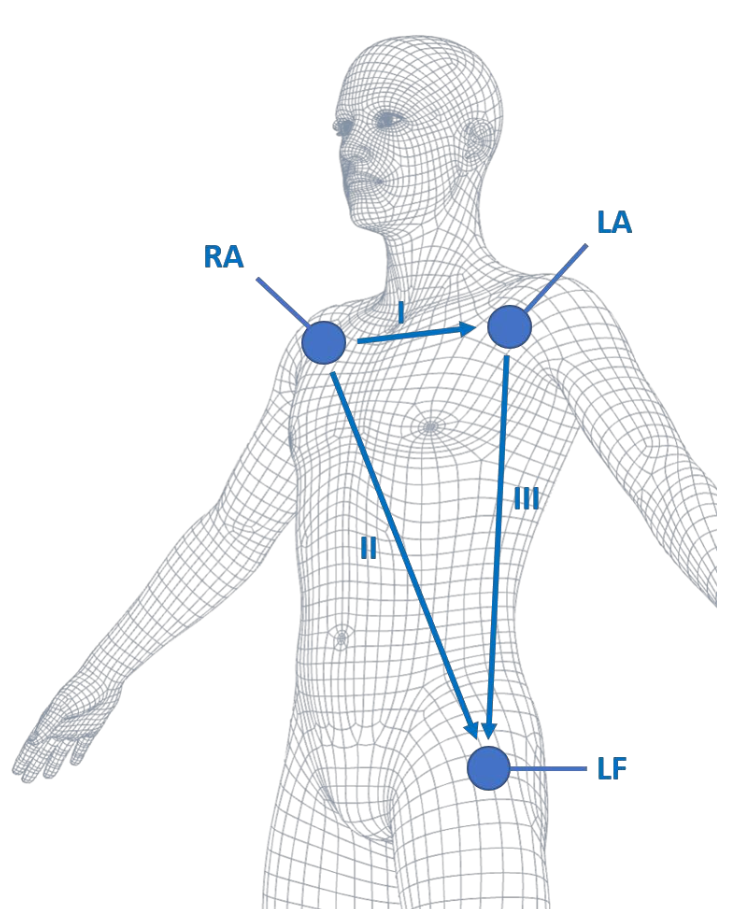
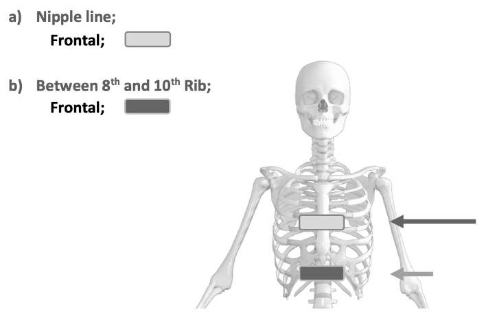

# Physiological Measures

## Specifications 

### Biosignalsplux Hybrid-8 Hub

| _Specification_ | Details |
|-----------------|---------|
| _Channels_ | 8 hybrid (digital/analog) channels 
|            | Can pair up to 2 more hubs for up to 24 channels |
| _Auxiliary Channels_ | 1 ground + 1 accessory port |
| _Connector Type_ | UC-E6 |
| _Sampling Rate_ | Software configurable from 10 to 3000 Hz |
|                 | Analog sensors: Up to 3000 Hz |
|                 | Digital sensors: Up to 500 Hz |
|                 | All sensors share the same sampling rate |
| _Resolution_ | Software configurable from 8 to 24 bits |
|              | Analog sensors: Up to 16 bits |
|              | Digital sensors: Up to 24 bits |
| _Dimensions_ | 85 x 54 x 10 mm |
| _Weight_ | 45 g |
| _Communication_ | Dual Bluetooth (Standard Bluetooth + BLE) |
|                 | Standard Bluetooth for Windows, Mac, Linux and Android |
|                 | Bluetooth Low Energy for iOS |
| _Bluetooth Range_ | Up to 10 meters in line of sight |
| _Internal Memory_ | 32 GB |
| _Battery Type_ | 700 mA 3.7 V LiPo rechargeable |
| _Battery Life_ | Up to 12 h in continuous streaming |
| _Charging Time_ | 2.5 h |
| _Software_ | OpenSignals (r)evolution - Windows, macOS & Linux |
|            | OpenSignals Mobile - Android |
| _Software Add-Ons_ | Heart Rate Variability (HRV) |
|                    | Electromyography (EMG) Analysis |
|                    | Electrodermal Activity (EDA) Analysis |
|                    | Respiration Analysis |
|                    | Video Synchronization |
|                    | Muscle Load Analysis |
| _Integration_ | Lab Streaming Layer (LSL) |
|               | TCP/IP |
| _Data Format_ | TXT, H5, EDF |
| _Accessories_ | 1x Bluetooth dongle |
|               | 1x Charger |
|               | 1x Portable & rugged storage case |
|               | 50x pre-gelled and disposable electrodes |
|               | ... ^^(check when in-office)^^ |
| _User Manual_ | [PDF](https://support.pluxbiosignals.com/wp-content/uploads/2021/12/biosignalsplux-Hybrid-8-User-Manual.pdf) |
| _Repositories_ | [GitHub](https://github.com/pluxbiosignals) |

### Sensors

| Sensors |
|-----------|
| Accelerometer (ACC) |
| Electrocardiography (ECG) |
| Electrodermal Activity (EDA) |
| Electromyography (EMG) |
| Inductive Respiration (RIP) |
| Peripheral Capillary Oxygen Saturation (SpO2) |

#### Accelerometer (ACC)

| _Specification_ | Details |
|-----------------|---------|
| _Sensor Type_ | Analog |
| _Sensor Technology_ | MEMS |
| _Axes_ | 3 axes (X, Y, Z) |
| _Range_ | ±3.60 g |
| _Bandwidth_ | 0-50 Hz |
| _Minimum Sampling Rate_ | 100 Hz (to prevent aliasing) |
| _Consumption_ | 0.5 mA |
| _Connections_ | 3 channels (1 for each axis) |
| _Calibration_ | Required (see "Application Notes" in user manual) |
| _Cable Length_ | 100 cm + 8.5 cm for each connector cable |
| _User Manual_ | [PDF](https://support.pluxbiosignals.com/wp-content/uploads/2021/10/biosignalsplux-Accelerometer-ACC-User-Manual.pdf) |
| _Datasheet_ | [PDF](https://support.pluxbiosignals.com/wp-content/uploads/2021/10/biosignalsplux-Accelerometer-ACC-Datasheet.pdf) |
| _Sample Data_ | [ZIP](https://support.pluxbiosignals.com/wp-content/uploads/2021/10/biosignalsplux-Sample-Signal-SampleACC.zip) |

#### Electrocardiography (ECG)

| _Specification_ | Details |
|-----------------|---------|
| _Sensor Type_ | Analog |
| _Gain_ | 1019 |
| _Range_ | ±1.47 mV (@ VCC = 3 V) |
| _Bandwidth_ | 0.5-100 Hz |
| _Minimum Sampling Rate_ | 200 Hz (to prevent aliasing) |
| _Consumption_ | 0.5 mA |
| _Input Impedance_ | > 100 GΩ |
| _CMRR_ | 100 dB |
| _Connections_ | 1 channel |
| _Calibration_ | Not required |
| _Electrode Number_ | 3x electrodes |
| _Electrode Connection Type_ | Stud connectors (compatible with disposable electodes) |
| _Reference Electrode_ | Included |
| _Electrode Placement_ | Single lead acquisition in Einthoven configurations (see user manual) |
| _Cable Length_ | 100 cm + 30 cm for each electrode cable |
| _OpenSignals Add-On_ | Heart Rate Variability (HRV) |
| _User Manual_ | [PDF](https://support.pluxbiosignals.com/wp-content/uploads/2021/10/biosignalsplux-Electrocardiography-ECG-User-Manual.pdf) |
| _Datasheet_ | [PDF](https://support.pluxbiosignals.com/wp-content/uploads/2021/10/biosignalsplux-Electrocardiography-ECG-Datasheet.pdf) |
| _Sample Data_ | [ZIP](https://support.pluxbiosignals.com/wp-content/uploads/2021/10/biosignalsplux-Sample-Signal-SampleECG.zip) |
| _Technical Note 1_ | [PDF](https://support.pluxbiosignals.com/wp-content/uploads/2021/10/Technical-Note-ECG-Sensor-Rest-Stress.pdf) |
| _Technical Note 2_ | [PDF](https://support.pluxbiosignals.com/wp-content/uploads/2021/12/ECG_Sensor_Effort_TN.pdf) |

#### Electrodermal Activity (EDA)

| _Specification_ | Details |
|-----------------|---------|
| _Sensor Type_ | Analog |
| _Range_ | 0-25 µS (@ VCC = 3 V) |
| _Bandwidth_ | 0-3 Hz |
| _Minimum Sampling Rate_ | 10 Hz (to prevent aliasing) |
| _Consumption_ | 0.1 mA |
| _Input Bias Current_ | ±70 pA |
| _CMRR_ | 130 dB |
| _Current_ | DC |
| _Measurement_ | Continuous |
| _Connections_ | 1 channel |
| _Calibration_ | Not required |
| _Electrode Number_ | 2x electrodes |
| _Electrode Connection Type_ | Stud connectors, compatible with disposable electodes |
| _Reference Electrode_ | Not required |
| _Electrode Placement_ | Anterior side of two adjacent fingers (see user manual) |
| _Cable Length_ | 100 cm + 5 cm for each electrode cable |
| _OpenSignals Add-On_ | Electrodermal Activity (EDA) Analysis |
| _User Manual_ | [PDF](https://support.pluxbiosignals.com/wp-content/uploads/2021/10/biosignalsplux-Electrodermal-Activity-EDA-User-Manual-1.pdf) |
| _Datasheet_ | [PDF](https://support.pluxbiosignals.com/wp-content/uploads/2021/10/biosignalsplux-Electrodermal-Activity-EDA-Datasheet.pdf) |
| _Sample Data_ | [ZIP](https://support.pluxbiosignals.com/wp-content/uploads/2021/10/biosignalsplux-Sample-Signal-SampleEDA.zip) |

#### Electromyography (EMG)

| _Specification_ | Details |
|-----------------|---------|
| _Sensor Type_ | Analog |
| _Gain_ | 1007 |
| _Range_ | ±1.49 mV (@ VCC = 3 V) |
| _Bandwidth_ | 25-500 Hz |
| _Minimum Sampling Rate_ | 1000 Hz (to prevent aliasing) |
| _Consumption_ | 1 mA |
| _Input Impedance_ | > 100 GΩ |
| _CMRR_ | 100 dB |
| _Connections_ | 1 channel |
| _Calibration_ | Not required |
| _Electrode Number_ | 2x electrodes |
| _Electrode Connection Type_ | Stud connectors (compatible with disposable electodes) |
| _Reference Electrode_ | Required |
| _Electrode Placement_ | 2 measuring electrodes must be placed along the muscle  and the reference electrode must be placed in a region of  low muscular activity (see user manual) |
| _Cable Length_ | 100 cm + 5 cm for each electrode cable |
| _OpenSignals Add-On_ | Electromyography (EMG) Analysis |
| _User Manual_ | [PDF](https://support.pluxbiosignals.com/wp-content/uploads/2021/10/biosignalsplux-Electromyography-EMG-User-Manual-1.pdf) |
| _Datasheet_ | [PDF](https://support.pluxbiosignals.com/wp-content/uploads/2021/10/biosignalsplux-Electromyography-EMG-Datasheet.pdf) |
| _Sample Data_ | [ZIP](https://support.pluxbiosignals.com/wp-content/uploads/2021/10/SampleEMG.zip) |
| _Technical Note_ | [PDF](https://support.pluxbiosignals.com/wp-content/uploads/2021/10/Technical-Note-EMG-Sensor-Facial.pdf) |

#### Inductive Respiration (RIP)

| _Specification_ | Details |
|-----------------|---------|
| _Sensor Type_ | Analog |
| _Bandwidth_ | 0.075-1 Hz |
| _Minimum Sampling Rate_ | 10 Hz (to prevent aliasing) |
| _Consumption_ | 1 mA |
| _Output_ | 0-3 V |
| _Operating Humidity_ | 5-95 % (non-condensing) |
| _Operating Temperature_ | 5-40 °C |
| _Connections_ | 1 channel |
| _Calibration_ | Not required |
| _Strap Length_ | 44-103 cm ^^(check when in-office)^^ |
| _Strap Placement_ | Thoracic or abdominal (see PZT user manual) |
| _Cable Length_ | 100 cm |
| _OpenSignals Add-On_ | Respiration Analysis |
| _User Manual_ | No manual for RIP, refer to this PZT manual for "Application Notes": [PDF](https://support.pluxbiosignals.com/wp-content/uploads/2021/10/biosignalsplux-Respiration-PZT-User-Manual.pdf) |
| _Datasheet_ | [PDF](https://support.pluxbiosignals.com/wp-content/uploads/2021/10/biosignalsplux-Respiration-RIP-Datasheet.pdf) |
| _Sample Data_ | [ZIP](https://support.pluxbiosignals.com/wp-content/uploads/2021/12/biosignalsplux-SampleRIP.zip) |

#### Peripheral Capillary Oxygen Saturation (SpO2)

| _Specification_ | Details |
|-----------------|---------|
| _Sensor Type_ | Analog |
| _Infrared emitter_ | Peak emission: 950 nm |
|                    | Centroid wave: 940 nm |
|                    | Spectral bandwidth: 42 nm |
|                    | Radiant intensity: 2 mW/sr |
| _Red emitter_ | Peak emission: 660 nm |
|               | Centroid wave: 655 nm |
|               | Spectral bandwidth: 17 nm |
|               | Radiant intensity: 2.6 mW/sr |
| _Detector_ | Wavelength of max sensitivity: 920 nm |
|            | Range of sensitivity: 400-1100 nm |
|            | Radiant sensitive area: 1.3x1.3 mm |
|            | Spectral sensitivity (940 nm): 0.77 A/W |
| _Infrared/Red emitter_ | Duty cycle: 25 % |
|                        | Min current: 0.20 mA |
|                        | Max current: 50 mA |
| _Sampling Rate_ | 500 Hz |
| _Connections_ | 1 channel |
| _Calibration_ | Not required |
| _Cable Length_ | 100 cm |
| _OpenSignals Add-On_ | Heart Rate Variability (HRV) |
| _Datasheet_ | [PDF](https://support.pluxbiosignals.com/wp-content/uploads/2021/10/biosignalsplux-SpO2-Versatile-Datasheet.pdf) |
| _Sample Data_ | [ZIP](https://support.pluxbiosignals.com/wp-content/uploads/2021/12/biosignalsplux-SampleSpO2.zip) |
| _Technical Note_ | [PDF](https://support.pluxbiosignals.com/wp-content/uploads/2021/10/Technical-Note-SpO2-Sensor-apnea.pdf) |

## Sampling Rate Lookup Table

| _Sensor_ | _Minimum Sampling Rate_ |
|----------|-------------------------|
| ACC      | 100 Hz                  |
| ECG      | 200 Hz                  |
| EDA      | 10 Hz                   |
| EMG      | 1000 Hz                 |
| RIP      | 10 Hz                   |
| SpO2     | 500 Hz                  |

If multiple sensors are used, the sampling rate should be at least as high as the highest minimum sampling rate required by any sensor to prevent aliasing in the acquired signals.

## Testing Protocols

### Accelerometer (ACC)

Work in progress...

### Electrocardiography (ECG)

1. Preparation
    - Set up the appropriate software tools to record and visualize the ECG signal.
    - Ensure the ECG sensor is properly calibrated according to the manufacturer’s instructions.
    - Instruct the subject to relax and remain still in the seated position throughout the testing procedure to minimize motion artifacts.
    - Clean the skin area where the sensor will be attached using an alcohol swab to remove any oil or dirt.
    - Properly place the ECG electrodes on the subject's body according to standard electrode placement guidelines (e.g., Lead I configuration).  
    

  
    

2. Baseline Testing
    - Record the signal for a fixed period (e.g., 60 seconds).
    - Review the recorded baseline ECG signals to ensure clarity, absence of noise, and proper detection of QRS complexes.
    - Inspect the signal for any abnormalities (e.g., high-frequency noise, baseline drift, artifacts).
3. Dynamic Testing
    - Conduct controlled exercise tests (e.g., jumping jacks) to induce physiological changes in heart rate and rhythm.
    - Monitor ECG signals during the testing period to assess the sensor's ability to accurately track dynamic changes in cardiac activity.
4. Noise and Artifact Assessment
    - Instruct the subject to perform controlled movements (e.g., arm swings, deep breathing) or introduce other artifacts (e.g., electrode movement, electrical interference) during ECG recording.
    - Assess the impact of artifacts and noise on ECG signal quality and reliability.
5. Documentation and Reporting
    - Document the results of testing protocol, including baseline measurements, artifact assessment and dynamic testing.
    - Summarize key findings regarding signal quality, consistency, and susceptibility to artifacts.
    - Provide recommendations for optimizing ECG signal acquisition based on the observed strengths and weaknesses of the sensor. Suggest potential improvements or adjustments to electrode placement, signal processing techniques, or environmental conditions.
    - Include any relevant data visualizations, graphs, or tables to support the findings and recommendations.

### Electrodermal Activity (EDA)

Work in progress...

### Electromyography (EMG)

1. Preparation
    - Set up the appropriate software tools to record and visualize the EMG signal.
    - Ensure the EMG sensor is properly calibrated according to the manufacturer’s instructions.
    - Instruct the subject to relax and remain still in the seated position throughout the testing procedure to minimize motion artifacts.
    - Clean the skin area where the sensor will be attached using an alcohol swab to remove any oil or dirt.
    - Place the bipolar electrodes over the muscle group you want to test (e.g., biceps). Place the reference electrode to the appropriate location. Refer to [SENIAM](http://www.seniam.org/) recommendations for sensor [location](http://www.seniam.org/sensor_location.htm) and [placement](http://www.seniam.org/fixation.htm).  
    

2. Baseline Testing
    - Ask the subject to relax the muscle where the sensor is attached.
    - Record the signal for a fixed period (e.g., 60 seconds). The signal should be close to zero, indicating no muscle activity.
    - Inspect the signal for any abnormalities (e.g., high-frequency noise, baseline drift, artifacts).

3. Muscle Activation Testing
    - Instruct the subject to perform a series of controlled muscle contractions and relaxations.
    - Ensure that the contractions are performed with consistent effort to avoid sudden changes in signal amplitude.
    - Ensure that the EMG sensor captures the full range of muscle activation and accurately reflects the intensity of contraction.
    - Take note of the muscle activity parameters, such as amplitude and duration of muscle contractions.
    - Repeat the test to compare the characteristics of muscle activity across different recordings to assess signal consistency and reliability.

4. Noise and Artifact Assessment
    - Ask the subject to relax the muscle where the sensor is attached.
    - Introduce controlled noise or artifacts during EMG signal acquisition (e.g., electrode movement, electrical interference).
    - Assess the impact of introduced artifacts on the EMG signal quality.

5. Documentation and Reporting
    - Document the results of testing protocol, including baseline measurements, muscle activation tasks and artifact assessment.
    - Summarize key findings regarding signal quality, consistency, and susceptibility to artifacts.
    - Provide recommendations for optimizing EMG signal acquisition based on the observed strengths and weaknesses of the sensor. Suggest potential improvements or adjustments to electrode placement, signal processing techniques, or environmental conditions.
    - Include any relevant data visualizations, graphs, or tables to support the findings and recommendations.

### Inductive Respiration (RIP)

1. Preparation
    - Set up the appropriate software tools to record and visualize the RIP signal.
    - Ensure the RIP sensor is properly calibrated according to the manufacturer’s instructions.
    - Instruct the subject to relax and remain still in the seated position throughout the testing procedure to minimize motion artifacts.
    - Properly place the strap on the subject's chest along the nipple line, as shown in the figure below:  
    

2. Chest Testing
    - Record baseline respiratory signals using the RIP sensor for a sufficient duration (e.g., 60 seconds) to establish stable baselines. 
    - Review the recorded baseline respiratory signals to ensure clarity, absence of noise, and consistent waveform morphology. Verify that the sensor accurately detects respiratory rate and patterns during rest.
    - Instruct the subject to perform controlled breathing exercises (e.g., slow deep breathing, rapid shallow breathing) at different respiratory rates and depths. Include respiratory pauses and apnea events followed by normal respiration.
    - Assess the sensor’s ability to capture and quantify changes in respiration dynamics.

3. Abdominal Testing
    - Change the position of the strap to the subject’s upper abdomen, between 8th and 10th ribs, as shown in the figure above.
    - Repeat the steps for chest testing, performing the same breathing exercises. Confirm that the signal recorded in the abdominal configuration presents a larger amplitude than the chest configuration.

4. Dynamic Testing
    - Instruct the subject to change body positions (e.g., sitting, standing, lying down) and perform controlled movements (e.g., arm swings, walking, jumping jacks) during RIP signal recording.
    - Assess the sensor's ability to accurately capture respiratory signals under different postural and dynamic conditions.

5. Noise and Artifact Assessment
    - Introduce noise and artifacts (e.g., strap movement, electrical interference) to simulate conditions that can affect the signal during the recording.
    - Assess the impact of artifacts and noise on RIP signal quality and reliability.

6. Documentation and Reporting
    - Document the results of testing protocol, including baseline measurements, artifact assessment and dynamic testing.
    - Summarize key findings regarding signal quality, consistency, and susceptibility to artifacts.
    - Provide recommendations for optimizing RIP signal acquisition based on the observed strengths and weaknesses of the sensor. Suggest potential improvements or adjustments to electrode placement, signal processing techniques, or environmental conditions.
    - Include any relevant data visualizations, graphs, or tables to support the findings and recommendations.

### Peripheral Capillary Oxygen Saturation (SpO2)

Work in progress...

## Software Setup

### OpenSignals

1. The software to use the Biosignals Plus is OpenSignals. Go the the following [website](https://support.pluxbiosignals.com/knowledge-base/introducing-opensignals-revolution/) and download **OpenSignals for Windows (64-bit)**.  

2. Once downloaded, open OpenSignals. You will be prompted to enter the activation code. The activation code provide is quite long - make sure to double check your entry!  

3. This is what the OpenSignals software looks like. [OpenSignals Manual](https://support.pluxbiosignals.com/wp-content/uploads/2021/11/OpenSignals_Manual.pdf) is the full manual for the software if you need it.  

### LSL Integration

The OpenSignals software already has LSL integrated, which makes set-up with LSL easy.

1. Open “LabRecorder - Shortcut” on the Desktop. The GUI should look like this:  

2. Go back to OpenSignals and click on the icon with 3 lines (see below):  

3. Click on the “Integration” tab on the far right. Check the box “Lab Streaming Layer” and “Continuous Mode”:  

4. Next, click the red record button in OpenSignals. You don’t need to do anything else once you click the red record button:  

5. Return to LabRecorder. Click “Update” on the bottom left. OpenSignals will then show up under “Record from Streams”.  

*[ACC]: Accelerometer
*[ECG]: Electrocardigraphy
*[EDA]: Electrodermal Activity
*[EMG]: Electromyography
*[RIP]: Inductive Respiration
*[SpO2]: Peripheral Capillary Oxygen Saturation
*[LSL]: Lab Streaming Layer
*[MEMS]: Micro-Electro-Mechanical Systems
*[HRV]: Heart Rate Variability
*[PZT]: Piezoelectric sensor
*[SENIAM]: Surface ElectroMyoGraphy for the Non-Invasive Assessment of Muscles
*[VCC]: Voltage at the Common Collector
*[CMRR]: Common Mode Rejection Ratio
*[GΩ]: Gigaohm
*[mA]: Milliampere
*[µS]: Microsiemens
*[Hz]: Hertz
*[mV]: Millivolt
*[V]: Volt
*[A]: Ampere
*[W]: Watt
*[mW]: Milliwatt
*[sr]: Steradian
*[nm]: Nanometer
*[mm]: Millimeter
*[cm]: Centimeter
*[C]: Celsius
*[PDF]: Portable Document Format
*[ZIP]: Zipped File
*[GUI]: Graphical User Interface
*[USB]: Universal Serial Bus
*[BLE]: Bluetooth Low Energy
*[LiPo]: Lithium Polymer
*[H5]: Hierarchical Data Format version 5
*[EDF]: European Data Format
*[TXT]: Text File
*[UC-E6]: A non-standard USB connector
*[h]: Hour
*[g]: Gram
*[GB]: Gigabyte
*[TCP]: Transmission Control Protocol
*[IP]: Internet Protocol
*[iOS]: iPhone Operating System
*[dB]: Decibel
*[pA]: Picoampere