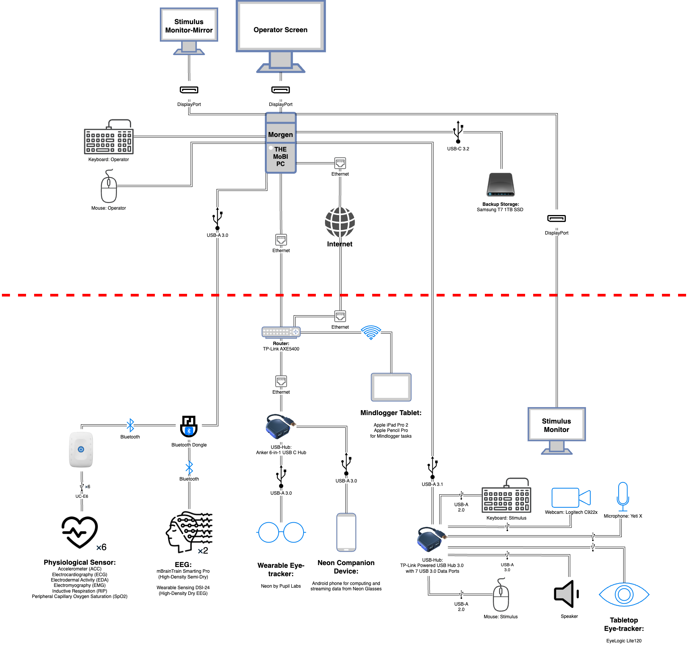

# The Next Generation of Data Collection is Multimodal

Nathalia Bianchini Esper^1^, Adam Santorelli^1^, Bryan Gonzalez^1^, Nicole Burke^1^, Samuel Louviot^1^, Alp Erkent^1^, Apurva Gokhe^1^, Camilla Strauss^1^, Celia Maiorano^1^, Iktae Kim^1^, Freymon Perez^1^, John Vito d’Antonio-Bertagnolli^1^, Stan Colcombe^1^ ^2^, Alexandre Rosa Franco^1^ ^2^, Gregory Kiar^1^, Michelle Freund^1^, Michael P. Milham^1^ ^2^

^1^ Child Mind Institute, New York, USA  
^2^ Nathan S. Kline Institute for Psychiatric Research, New York, USA  

---

## Introduction
With the continuous refinement of brain imaging methods such as MRI and EEG, researchers are gaining better insights into brain structure, function, and connectivity, enabling advances in understanding neurological and psychiatric disorders, as well as the neural basis of cognition, behavior, and emotion (Warbrick, 2022). A multimodal approach allows researchers to integrate complementary data types, addressing limitations of single-modality experiments and providing a broader perspective on brain function, connectivity, facial expressions, body language, and environmental context (Calhoun & Sui, 2016; Wagner et al., 2019). This approach is particularly valuable in social and cognitive sciences, offering deeper insights into communication, emotion regulation, and social interactions (Madsen & Parra, 2024). 

Here, we present a laboratory design for the next generation of data collection: a multimodal brain/body imaging approach (MoBI). A MoBI laboratory (Makeig et al., 2009) uses various techniques and data sources to examine brain activity in dynamic, interactive scenarios, along with other physiological and behavioral measures, including EEG, eye-tracking, motion capture, electromyography (EMG), electrocardiography (ECG), galvanic skin response, and audio/video recordings.

---

## Methods
Multimodal data collection presents two primary challenges:

1. **Hardware and Software Requirements**: Each modality's hardware and software requirements often rely on multiple computing systems and peripheral devices, creating logistical and operational burdens.
2. **Synchronization**: The independent acquisition of data streams for each modality results in separate files, complicating synchronization of timestamps across devices.

To overcome these challenges, we developed a centralized hub and data collection system for MoBI setups. This approach consolidates data streams from multiple modalities onto a single computer using the Lab Streaming Layer (LSL) framework (Kothe et al., 2024). By leveraging a shared system clock, we achieve precise synchronization and effective correction for time drift across devices, eliminating the need for additional synchronization hardware or extensive post hoc adjustments. 

An integrated architecture reduces latency and hardware complexity, ensures real-time monitoring, and maintains the temporal fidelity of multimodal datasets. To support this implementation, we developed comprehensive documentation that provides detailed guidance on every step of the process, from equipment evaluation through data collection. The documentation includes:

- Hardware specifications for building a MoBI system.
- Configuration details for the centralized computer.
- Best practices for data acquisition.

This documentation aims to streamline the process for researchers and facilitate the adoption of robust and synchronized multimodal data collection workflows.

---

## Results
We have successfully integrated a range of data acquisition systems into our MoBI framework, including (but not limited to):

- Dry and semi-dry EEG systems.
- Table-top and wearable eye-tracking devices.
- Physiological measurement modalities such as electrocardiography, electrodermal activity, inductive respiration, and peripheral oxygen saturation.

Additionally, the setup supports:

- Multiple audio and video streams.
- Motion capture systems.
- Cognitive task presentations using PsychoPy and MindLogger (Klein et al., 2021).

**Figure 1** shows a schema of our setup. By centralizing computing resources to a single device, we exhibit a cost reduction of up to 50% compared to traditional laboratory designs.

---

## Conclusions
Preliminary testing has demonstrated the LSL framework's robust capability to achieve clock synchronization and time drift correction across diverse devices, ensuring accurate temporal alignment of multimodal datasets. Our detailed documentation, publicly hosted at [childmindresearch.github.io/MoBI_Docs](https://childmindresearch.github.io/MoBI_Docs), provides the research community with a valuable resource for replicating and adapting these methodologies for multimodal studies.

---

## References
- Calhoun, V. D., & Sui, J. (2016). Multimodal fusion of brain imaging data: A key to finding the missing link(s) in complex mental illness. *Biological Psychiatry: Cognitive Neuroscience and Neuroimaging, 1*(3), 230–244. https://doi.org/10.1016/j.bpsc.2015.12.005
- Klein, A., et al. (2021). Remote Digital Psychiatry for Mobile Mental Health Assessment and Therapy: MindLogger Platform Development Study. *J Med Internet Res, 23*(11), e22369. https://doi.org/10.2196/22369
- Kothe, C., et al. (2024). The Lab Streaming Layer for synchronized multimodal recording. *bioRxiv*. https://doi.org/10.1101/2024.02.13.580071
- Madsen, J., & Parra, L. C. (2024). Bidirectional brain-body interactions during natural story listening. *Cell Reports, 43*(4), 114081. https://doi.org/10.1016/j.celrep.2024.114081
- Makeig, S., et al. (2009). Linking brain, mind and behavior. *International Journal of Psychophysiology, 73*(2), 95–100. https://doi.org/10.1016/j.ijpsycho.2008.11.008
- Wagner, J., et al. (2019). High-density EEG mobile brain/body imaging data recorded during a challenging auditory gait pacing task. *Scientific Data, 6*(1), 211. https://doi.org/10.1038/s41597-019-0223-2
- Warbrick, T. (2022). Simultaneous EEG-fMRI: What have we learned and what does the future hold? *Sensors, 22*(6), 2262. https://doi.org/10.3390/s22062262
