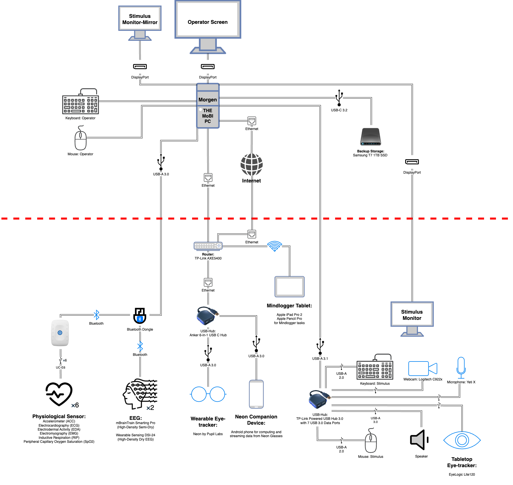

# Computer Hardware & Software Setup

## Hardware Setup

### Preparation

1. Ensure that you have purchased and in your possession all components listed in [PC Components](https://pcpartpicker.com/user/cmi_mobi/saved/#view=Qg3JkL).
2. Allocate two hours for the build process.
3. Prepare a clean, flat, non-conductive tabletop workspace.
4. Obtain a phillips-head screwdriver.
5. Prepare an area to store all included manuals and extra hardware components.

### Assembly

1. Prepare the motherboard.
    - Remove the motherboard and all included components from their packaging.
    - Place the motherboard on top of the cardboard motherboard box.
    - Remove any plastic film on the motherboard and motherboard i/o shield.
    - Keep the motherboard accessories handy for use in later steps.
    - Refer to the Motherboard manual to visually identify the location of each component.
2. Attach the CPU.
    - Remove the CPU from its packaging.
    - On the motherboard, remove the plastic CPU placeholder from the CPU socket.
    - Lift the CPU bracket locking arm from its holder, and lift the CPU bracket.
    - Gently place the CPU right-side up in the CPU socket. Small notches on the CPU and CPU socket indicate the correct orientation, as does the lettering on the CPU.
    - Gently lower the CPU bracket. Gently wiggle the CPU with one finger to ensure that it remains seated properly.
    - Slowly lower and lock the CPU bracket locking arm.
3. Prepare the CPU cooler mount.
    - Open the CPU cooler box, and find all Intel-related components. Reference the instruction manual as needed.
    - Set up the backplate. Identify the side of the backplate that should face the motherboard. Insert four tall mounting bolts through the rear of the backplate, with bolt legs facing “upwards” through where the motherboard will be. Ensure that the triangular bolt heads are aligned with the outermost available positions on the backplate.
    - Affix the bolts using four clip-on plastic spacers.
    - Flip the motherboard over to its back.
    - Insert the assembled backplate bolts through the mounting holes on the motherboard.
    - Re-flip the motherboard to its front.
    - Place one blue plastic spacer on each of the four mounting bolts.
    - Place an arc-shaped mounting bar across the top two and bottom two mounting bolts, over the blue plastic spacers. The mounting bars should make a frowny face on top of the motherboard, and a smiley face right below. Affix the mounting bars with thumb screws, finger tighten.
4. Attach the RAM.
    - Remove the RAM from its packaging.
    - Refer to the motherboard manual to identify the suggested configurations for RAM placements.
    - Ensure that the RAM locking brackets on DIMMs A2 (2nd from left) and B2 (rightmost) are in the open position.
    - Align a stick of RAM with a RAM socket (either A2 or B2, order does not matter). A cutout on the RAM stick should align with a notch on the RAM socket.
    - Gently insert the RAM stick into the socket, perpendicular to the motherboard, until both locking brackets click into place.
    - Repeat for the remaining RAM stick.
5. Attach the main M.2 SSD.
    - Remove one M.2 SSDs from its packaging.
    - Using a phillips-head screwdriver, remove the M.2 heatsink from the motherboard by removing two phillips-head screws. If the M.2 SSD heatsink has a liner, remove it. Place the heatsink upside-down on a flat surface to prevent it from sticking to the surface.
    - Place an M.2 SSD into the M.2 socket. A cutout on the M.2 stick should align with a notch on the M.2 socket. Gently press the end of the M.2 stick into the socket, parallel to the motherboard.
    - Replace the heatsink on top of the M.2 SSD, and tighten the two phillips-head screws until finger tight.
6. Attach the second M.2 SSD.
    - Remove one M.2 SSD from its packaging.
    - Identify the bottom-right-most M.2 socket on the motherboard.
    - Place an M.2 SSD into the M.2 socket. A cutout on the M.2 stick should align with a notch on the M.2 socket. Gently press the end of the M.2 stick into the socket, parallel to the motherboard.
    - Use a small phillips-head screw and a small washer (if provided) from the motherboard accessories to affix the left end of the M.2 SSD to the motherboard standoff.
7. Apply thermal paste.
    - Remove the cap of the thermal paste.
    - Apply a 3-4mm dot of thermal paste directly in the center of the CPU.
    - Apply four 2mm dots of thermal paste in each corner of the CPU, approximately 6mm from the edges.
8. Attach the CPU cooler.
    - Remove the pre-attached fan from the CPU radiator by pulling the wire clips away from the heatsink.
    - Remove the heatsink protection cover from the bottom of the radiator.
    - Gently place the CPU radiator on top of the CPU, with radiator banks vertical.
    - Affix the CPU radiator to the CPU cooler mounting bars using the pre-attached screws, and finger tighten.
    - Reattach the CPU fan to the leftmost radiator, in the center of the two radiators, in the position it was pre-installed. Ensure that the fan’s power cable is on the top side, motherboard-facing. Ensure that the fan is oriented to pull air from the front and push air to the rear.
    - Attach the spare CPU fan to the rightmost radiator, on the right-hand side. Ensure that the fan’s power cable is on the top side, motherboard-facing. Ensure that the fan is oriented to pull air from the front and push air to the rear. This may require removing and reattaching the wire clips from the CPU fan to ensure the correct orientation.
9. Prepare the case.
    - Remove the left and right sides of the computer case by loosening the thumb screws with yellow washers on the rear of the case.
    - Remove the front side of the case by gently pulling on the sides of the grid structure to pop it out from its plastic seats. Then, pull the tab at the top of the mesh cover to remove it from its magnetic seat.
    - Remove all rear i/o slots. Loosen and remove all seven thumb screws, and remove all seven thin metal bars. Keep handy for reuse in a later step.
10. Install the case fans.
    - Two case fans are preinstalled on the case – a center-mounted front fan, pulling air from front and pushing to rear; and a top-mounted rear fan, pulling air from front and pushing to rear.
    - Install the two case fans on the front top and bottom using screws from the motherboard accessories. Ensure that each fan’s power cable is on the top side, motherboard-facing. Ensure that the fan is oriented to pull air from the front and push air to the rear.
11. Install the power supply.
    - Slide the power supply into position from the right side of the case. Affix to power supply to rear of the case using three screws from the motherboard accessories labeled PSU. When viewing the case from the rear, the power supply should be visible with a power switch and power port facing outward, and the Corsair pirate sails logo facing upright.
12. Install the motherboard.
    - Place the case down on its right side. The case front should be on your right, and its rear at your left.
Gently lower the motherboard into the PC case. The CPU cooler should be at the top center. Preinstalled standoffs in the case will help ensure that the motherboard is seated correctly. Ensure that the rear i/o shield is properly aligned with the case by looking at the rear of the case.
    - Affix the motherboard to the case using phillips-head screws and washers from the case accessories box. Make sure to affix at least each of the four corners, even the hard to get top left one, as well as any other attachment points you have access to.
13. Prepare and connect wiring.
    - Mobo 12
    - Mobo 8
    - Case pins
    - Case usb
    - Case fans
    - Cpu fans and splitter
    - Gpu pcie
14. Connect the graphics card.
    - Remove all plastic film from the graphics card.
    - Ensure that the uppermost PCIe slot(PCIe 1) mounting bracket is in the open position.
    - Gently slot the graphics card into the uppermost PCIe slot, ensuring that the graphics card i/o aligns with the i/o slot on the rear of the case. Gently press the graphics card until the mounting bracket clicks closed.
    - Affix the graphics card using two thumb screws. Replace the i/o bar directly above the graphics card i/o with a third thumb screw.
    - Connect the 600W 12+4 pin GPU connector to the graphics card.
15. Connect the USB PCIe card.
    - Remove all plastic film from the USB PCIe card.
    - Attach the included metal i/o shield to the USB PCIe card using two included screws and the included phillips-head screwdriver.
    - Gently slot the USB PCIe card into the uppermost available PCIe x4 slot. This should leave space for one i/o bar between the bottom of the graphics card i/o and the top of the USB PCIe card i/o.
    - Affix the PCIe USB card using one thumb screw. Replace the i/o bar directly above the USB PCIe card i/o with a second thumb screw.
16. Connect the WiFI PCIe card.
    - Remove all plastic film from the WiFi PCIe card.
    - Gently slot the WiFi PCIe card into the uppermost available PCIe x4 slot. This should leave space for one i/o bar between the bottom of the USB PCIe card i/o and the top of the WiFi PCIe card i/o.
    - Affix the WiFi USB card using one thumb screw. Replace the i/o bar directly above the WiFi PCIe card i/o with a second thumb screw.
17. Connect the WiFI PCIe card cable to the motherboard using WHICH PINS
    - Reassemble the case.
    - Reattach the left and right sides of the computer case by tightening the thumb screws with yellow washers on the rear of the case.
    - Reattach the front of the case by reinserting the magnetic mesh. Then, gently push the sides of the grid structure in until all four plastic sockets snap into place.
18. Attach the WiFi antenna.
    - Unwrap the WiFI antenna cable.
    - Use fingers to finger-tighten two gold connectors on the antenna cable to two gold sockets on the WiFi PCIe card on the bottom rear of the case. The order of the cables does not matter.
    - Wrap and contain the leftover cabling with a twist-tie.
    - Affix the magnetized WiFi antenna to the rear of the case to the right of the WiFi and USB PCIe i/o.

### Initialization

1. Connect the power cable.
2. Ensure that the PSU switch is in the ON position.
3. Connect a wired keyboard and mouse to any available USB ports on the motherboard i/o, NOT the PCIe USB card.
4. Connect the Windows 11 Pro USB key to any available USB port on motherboard i/o.
5. Connect an ethernet cable with internet access to the motherboard i/o ethernet port.
6. Connect a display to the graphics card using an HDMI or DisplayPort cable.
7. Power on the PC by pressing the power button on the top of the case.

## Software Setup

### Install OS

1. Press F11 in boot screen to go into Windows Installation mode.
2. Follow the on-screen instructions.
3. Work or School - ID - PWD
4. Something about contacting IT
5. Remove all programs from Startup Apps
6. Uninstall all extra applications

### Update Drivers

1. Go to the following [website](https://www.intel.com/content/www/us/en/download/19347/chipset-inf-utility.html) and download “Chipset INF Utility”. It will download a .exe file. Open that file open and accept the agreements.
2. After it is installed, restart your computer.
3. Open Device Manager, and install / update drivers for all the devices the computer has a yellow triangle for.

<!-- ## These to go into a seperate page, as peripherals setup

###
Something In here with refer to all the other modalities for software installation pertaining to that methodology -->

## Wiring Diagram and Connection Schema

## LSL & Software Setup (Should be a seperate page)

Almost there...

## Router Setup

1. Plug in power and press the power button located on the backside of the router.
2. Using your device (LSL streaming computer), connect to the router, either through WiFi (SSID will be TP-Link_####, TP-Link_####_5G, TP-Link_####_6G) or the Ethernet cable (Use one of the orange LAN1 ~ LAN4 ports on the back of the router). The initial SSID and Password / PIN is provided in a Wi-Fi Info card, as well as on the bottom of the router
3. Once connected to the router, initially, a prompt / pop-up page to set up an administrator password may appear. If so, set up the administrator password accordingly. (PLEASE NOTE THAT THIS IS NOT YOUR WIFI CONNECTION PASSWORD) If this step has been missed / does not appear, open a browser from the device connected to the router and go to one of the following addresses. From there the router connection settings can be changed. While it is recommended that the SSID and the Passwords are changed, this is not a required step:
    - 192.168.0.1
    - tplinkwifi.net
4. Optional: Check the box OFDMA Enabled
    

5. For Windows: If the streams are still not showing up on LabRecorder, follow these steps to allow LabRecorder to communicate through Windows Defender Firewall:
    - From Start Menu, goto Windows Security
    - From the list of tabs from on the left hand side, click on “Firewall & network protection”, then “Allow an app through firewall”
    

    - Make sure all of the labrecorder.exe are allowed (noted with a check mark on the left side of the application name). If not, click on Change settings, and allow all the labrecorder.exe by clicking on the checkboxes next to their names, and make sure to press ok at the bottom to save your changes
    

